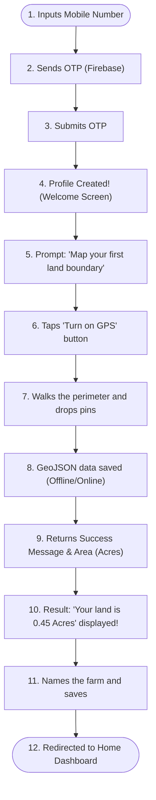
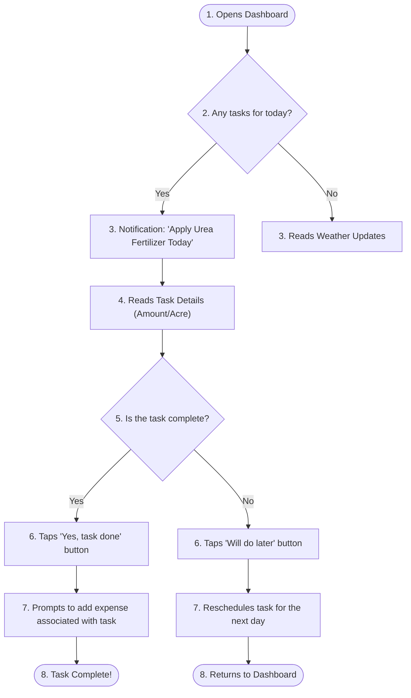
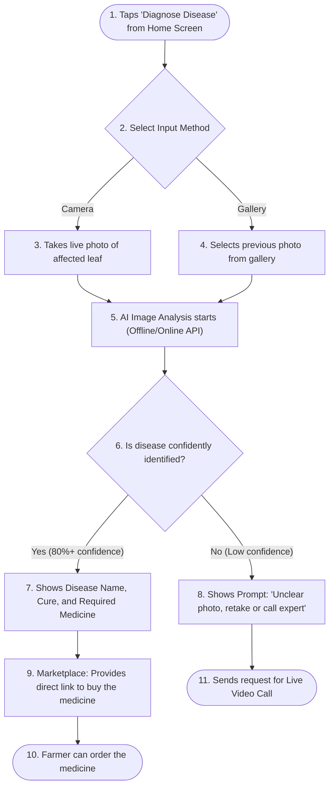

# UX Phase 3: Information Architecture & User Flow

In this document, we are working on the **Structure Layer** of our AgriTech application. The main goal is to create a visual map of how different pages and functions of the app will connect with each other (Information Architecture) and how a farmer or user will navigate from one step to another (User Flow).

We are using **Mermaid** diagrams to create these structural maps. (To view them larger, you can use your screen in zoom or landscape mode).

---

## 1. Information Architecture (IA) - Sitemap
Based on our previously created Strategy and Scope, keeping marginal farmers in mind, the app's navigation must be extremely Flat (shallow), so they don't have to click too many times to go deep.

The sitemap below shows the layout of the app's core screens.

```mermaid
graph TD
    Home["Home / Dashboard"]
    
    CropGov["1. Land & Crops"]
    FinGov["2. Finance / Ledger"]
    AgroMarket["3. Market & Retail"]
    ExpertHelp["4. Expert & AI Support"]
    ProfileSet["5. Profile & Settings"]

    Home --> CropGov
    Home --> FinGov
    Home --> AgroMarket
    Home --> ExpertHelp
    Home --> ProfileSet

    CropGov --> MapLand["GPS Mapping (Measure Land)"]
    CropGov --> SelectCrop["Crop Selector"]
    CropGov --> DailyTask["Daily Crop Calendar"]

    FinGov --> AddIncome["Add Income (+)"]
    FinGov --> AddExpense["Add Expense (-)"]
    FinGov --> ProfitLoss["BCR Report (Profit/Loss)"]

    AgroMarket --> BuyInput["Buy Inputs (Seeds/Fertilizer)"]
    AgroMarket --> SellCrops["Sell Output (Harvest)"]
    AgroMarket --> MarketPrice["Live Market Prices"]

    ExpertHelp --> AIDoctor["AI Camera (Disease Diagnosis)"]
    ExpertHelp --> VideoCall["Live Video with Expert"]
    ExpertHelp --> Weather["Weather Alerts"]

    ProfileSet --> OfflineSync["Cloud Sync Status"]
    ProfileSet --> LangPref["Language Options"]
    ProfileSet --> SupportCon["Help / Support"]
    
    style Home fill:#2e8b57,stroke:#fff,stroke-width:2px,color:#fff
    style CropGov fill:#90ee90,stroke:#333
    style FinGov fill:#90ee90,stroke:#333
    style AgroMarket fill:#90ee90,stroke:#333
    style ExpertHelp fill:#90ee90,stroke:#333
    style ProfileSet fill:#90ee90,stroke:#333
```

---

## 2. Core User Flows
While IA shows how information is organized, a User Flow shows how a user will accomplish a task step-by-step in a real-world scenario. We have created 3 of the most critical user flows for farmers here.

### User Flow 1: Onboarding & Mapping First Land
This flow is extremely crucial for retaining farmers in the app. It will operate on a completely "Zero-typing" mechanism.

### User Flow 2: Daily AI Task & Calendar 
This represents the app's Core Engagement Loop, which will motivate the farmer to log in every day.

### User Flow 3: AI Disease Detection 
This is the most practical feature for when a farmer notices an issue with their crops.

---

## 3. Structural Strategy Decisions (IA Principles)
* **Rule 1 (The 3-Tap Rule):** A farmer should never require more than 3 taps to reach any critical function.
* **Rule 2 (Flat Hierarchy):** No menus or pages should be buried deep. All core modules will remain arranged as UI cards on the Home Screen (Card UI is more effective than bottom navigation here).
* **Rule 3 (Conversational UX):** Menu items must use natural, conversational language rather than formal bookkeeping terms (e.g., "Income and Expense" instead of "Financial Ledger").
* **Rule 4 (Offline Fallback Paths):** If internet is unavailable, flows must present positive options like "Data saved, will sync when online" rather than displaying error messages.
